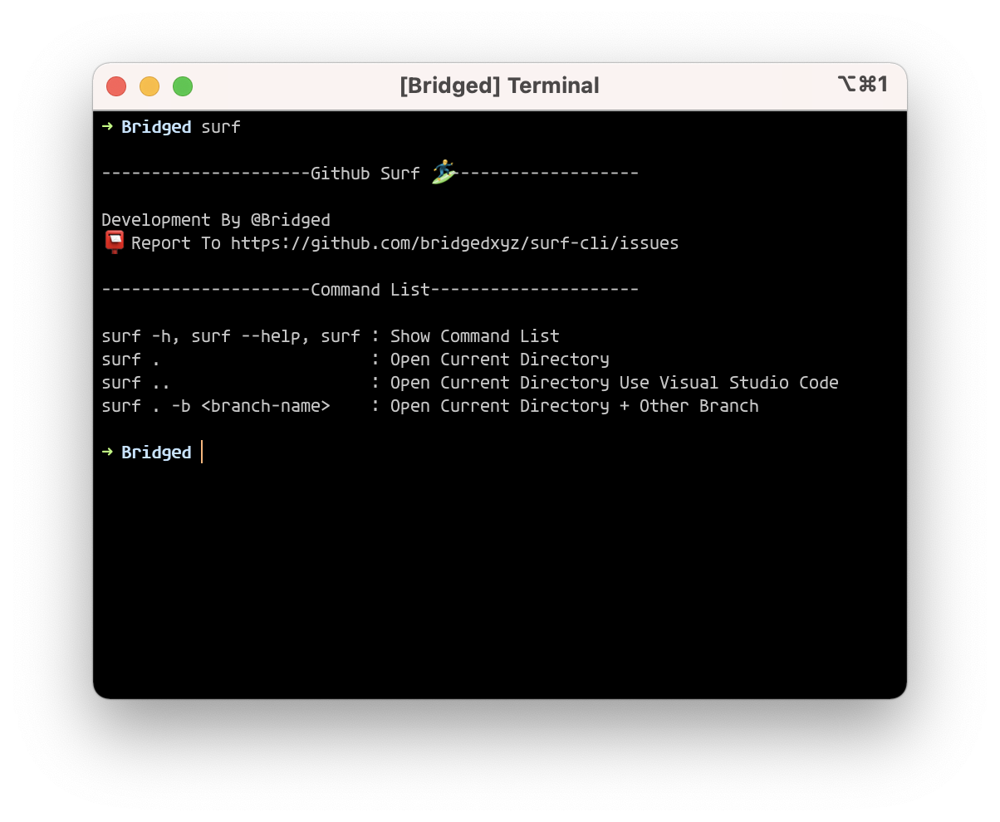

# 🏄‍♂️ Surf

<p align="center">
    <image src="./branding/surf-cli-cover.png"/>
</p>
<p align="center">
  <a href="https://www.npmjs.com/package/@bridged.xyz/surf">
    <image alt="surf cli on npm" src="https://img.shields.io/badge/cli-latest-brightgreen"/>
  </a>
</p>

## Installation

**NPM**

| Install:                           | Upgrade:                        |
| ---------------------------------- | ------------------------------- |
| `npm install -g @bridged.xyz/surf` | `npm upgrade @bridege.xyz/surf` |

**YARN**
| Install: | Upgrade: |
| ----------------------------------- | -------------------------------- |
| `yarn global add @bridged.xyz/surf` | `yarn upgrade @bridege.xyz/surf` |

## Demo


## Documentation



**View Current Repo**

```shell
surf .
```

Open the currently connected Github repository immediately.

**Open Visual Studio Code**

```shell
surf ..
```

If you have VS-Code installed, VS-Code opens right away, like `code .`

**Open Current Repo + Branch**

```shell
surf . -b <bracnh-name> OR surf -b <branch-name>
```

Opens a specific branch of the current repository on the web.

**Open Help**

```shell
surf -h, surf --help, surf
```

Open Help.

## Contributing

If you feel something strange or don't have some functionality, write an issue. You can find instructions on how to share feedback, create tools locally, and submit pull requests to your project.
